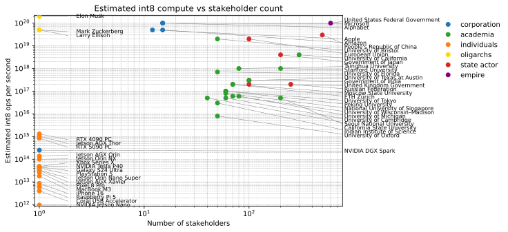

# Compute

This project catalogues estimated int8 compute accessible to different actors. You will notice that OpenAI is absent; they don't own any hardware, they rent it from Microsoft. This is a list of people/groups who own and control decisions about how ai compute is used.

The chart compares relative compute power of different classes of entities, versus stakeholder counts:

- [Amazon](./entities/amazon.md)
- [Apple](./entities/apple.md)
- [California State University](./entities/california-state-university.md)
- [Elon Musk](./entities/elon-musk.md)
- [iPhone 16](./entities/iphone-16.md)
- [Meta](./entities/meta.md)
- [Microsoft](./entities/microsoft.md)
- [United States Federal Government](./entities/united-states-federal-government.md)
- [University of California](./entities/university-of-california.md)

