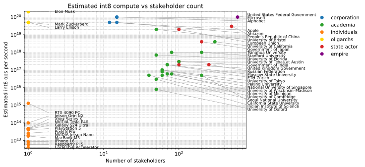
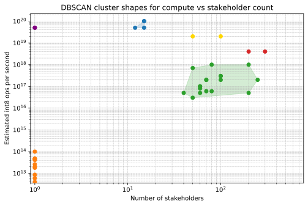

# Compute

This project catalogues estimated int8 compute accessible to different actors. You will notice
that OpenAI is absent; they don't own any hardware, they rent it from Microsoft. This is a
list of people or groups who own and control decisions about how AI compute is used.

## Cluster shapes

This figure outlines DBSCAN clusters for compute versus stakeholder counts. 
It looks for groups of entities with similar characteristics which are 
sufficiently separate from other groups to be considered distinct.
Learn more about the DBSCAN analytical technique [here](https://cjtrowbridge.com/ai).

<h2>Entity List</h2>
This is the list of the data from all the entity files when the analysis was last run, along with their estimated
int8 compute capcaity and number of stakeholders. You can sort the table by clicking on the column headers.
You can edit the data in the appropriate entity file, linked below.

    

        

            

                <h2 class="card-title">Entities</h2>
                <ul class="list-unstyled mb-0">
                    
                    
                    <li><a href="{{ entity.url | relative_url }}">{{ entity.title }}</a></li>
                    
                </ul>
            

        

    

    

        

            

                <h2 class="card-title">Files</h2>
                <ul class="list-unstyled mb-0">
                    <li><a href="{{ '/analysis/compute/' | relative_url }}">index.md</a></li>
                    
                    
                    
                    <li><a href="{{ file.path | relative_url }}">{{ file.name }}</a></li>
                    
                    
                </ul>
            

        

    

